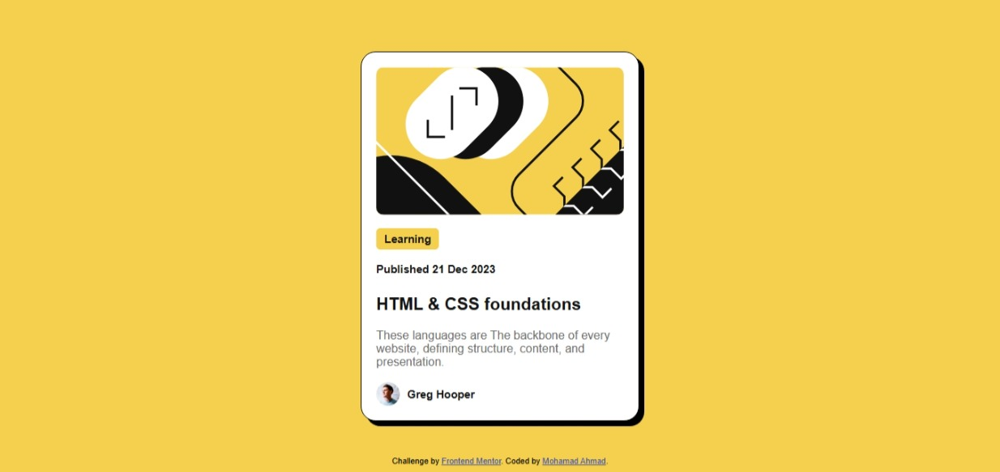

# Frontend Mentor - Blog preview card solution

This is a solution to the [Blog preview card challenge on Frontend Mentor](https://www.frontendmentor.io/challenges/blog-preview-card-ckPaj01IcS). Frontend Mentor challenges help you improve your coding skills by building realistic projects.

## Table of contents

- [Overview](#overview)
  - [The challenge](#the-challenge)
  - [Screenshot](#screenshot)
  - [Links](#links)
- [My process](#my-process)
  - [Built with](#built-with)
  - [What I learned](#what-i-learned)
  - [Continued development](#continued-development)
  - [Useful resources](#useful-resources)
- [Author](#author)

## Overview

### The challenge

Users should be able to:

- See hover and focus states for all interactive elements on the page

### Screenshot

### Links

- Solution URL: [https://github.com/mohamad0ahmad/Blog-preview-card](https://github.com/mohamad0ahmad/Blog-preview-card)
- Live Site URL: [https://mohamad0ahmad.github.io/Blog-preview-card/](https://mohamad0ahmad.github.io/Blog-preview-card/)

## My process

### Built with

- Semantic HTML5 markup
- CSS custom properties
- Flexbox
- CSS flex
- Mobile-first workflow

### What I learned

While building this project, I reinforced my understanding of **Flexbox** for centering elements both vertically and horizontally, and I also practiced **responsive design** using a mobile-first workflow.  
I also learned how to:

- Use `fit-content` for element sizing so borders wrap exactly around content.
- Apply hover and focus states to links to make the UI more interactive.
- Properly use the universal selector `*` for resets without affecting performance.
- Keep components reusable and neatly styled with clean class targeting.

### Continued development

In future projects, I want to:

- Improve my mastery of CSS Grid for more complex layouts.
- Practice creating reusable CSS components and utility classes.
- Work more with accessibility best practices, ensuring all interactive elements are usable via keyboard navigation and screen readers.

### Useful resources

- [CSS W3schools](https://www.w3schools.com/Css/default.asp) - This helped me for remembering CSS syntax and properties.
- [HTML Cheatsheet](https://htmlcheatsheet.com/) - This helped me for remembering HTML tags and attributes.
- [MDN Web Docs](https://developer.mozilla.org/en-US/) - Great for in-depth explanations of CSS properties and HTML elements.

## Author

- Website - [Mohamad Ahmad](https://www.linkedin.com/in/mohamad0ahmad/)
- Frontend Mentor - [@mohamad0ahmad](https://www.frontendmentor.io/profile/mohamad0ahmad)
